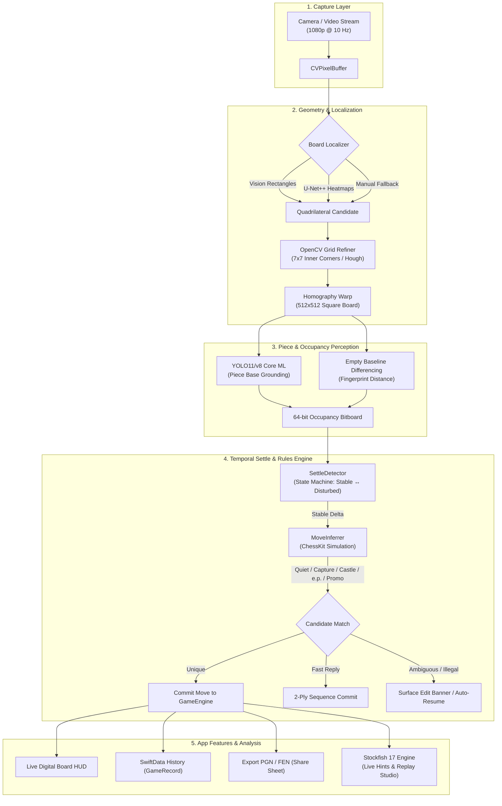

# Takes

<p align="center">
  <strong>Turn any physical chessboard into a live digital game with your iPhone.</strong><br>
  Real-time camera perception, settle-based move inference, PGN/FEN generation, and on-device Stockfish 17 analysis.
</p>

<p align="center">
  
  
  
  
  
  
  
  
</p>

---

## Overview

Over-the-board chess between friends is tactile, fast, and social. But the moment the pieces are swept into the box, the game is gone forever unless someone manually wrote down the moves. 

- **Manual notation** is slow, breaks social flow, and is rarely used in casual games.
- **Electronic DGT / smart boards** cost $500+, require dedicated proprietary pieces, and aren't portable.
- **Digital chess apps** record *screen taps*, not *physical moves*.
- **Academic CV prototypes** require overhead rigs, desktop computers, or rigid studio lighting.

**Takes** solves this with a single commodity iPhone propped at the side of the board. Point the camera, confirm the starting position, and play normally. Takes continuously tracks the physical board, ignores occluding hands, uses the formal rules of chess to resolve visual noise, and produces a live digital board, instant FEN, clean PGN, and full on-device Stockfish 17 game analysis.

---

## The Engineering & HCI Thesis

> *"Computer vision is allowed to be noisy; chess rules resolve physical uncertainty."*

Traditional attempts at camera chess often fail because they treat every frame as an isolated 12-class piece classification problem across 64 tiles. When hands hover, shadows cast, or pieces obscure each other, 64-tile classifiers break down.

Takes replaces brute-force classification with a three-pillar pipeline:

1. **Geometry over Pixels**: Automatically localizes the board quad (Apple Vision + U-Net++ heatmap corner detection), refines the grid using OpenCV inner-corner lattice extrapolation, and homography-warps the angled board into a normalized 512×512 top-down plane.
2. **Temporal Settle**: Hands hovering, pieces in mid-air, or capture slides are classified as *disturbed states*. Moves are only evaluated when the board's physical occupancy has settled completely (default 600 ms).
3. **Constraint-Solving Legal Move Inference**: Instead of guessing what a piece is from noisy pixels, Takes queries the [ChessKit](https://github.com/chesskit-app/chesskit-swift) rules engine for all legal moves in the current position, simulates their resulting bitboards, and finds the unique legal move that explains the physical delta.

```
Visual Change Detected → Hands Leave Board → Board Settles (600ms) → Simulate Legal Moves → Unique Match Committed
```

---

## System Architecture & Pipeline



---

## Core Features

### 📷 Smart Board Detection & Homography
- **Dual-Engine Auto Detection**: Uses Apple Vision (`VNDetectRectanglesRequest`) with grid-likeness & quadrature scoring, alongside an optional Core ML U-Net++ heatmap model (`ChessboardUNet.mlpackage`, adapted from [chessdetect-tfjs](https://github.com/Elucidation/chessdetect-tfjs)) detecting corners (TL, TR, BR, BL) from peak distributions.
- **OpenCV Grid Refinement**: Bridges OpenCV C++ imgproc (`findChessboardCorners`) to find inner 7×7 intersection lattices and extrapolate the true 9×9 grid, eliminating lens distortion and padded border drift.
- **Tactile 4-Corner Calibration Fallback**: If automatic detection struggles under difficult lighting, drag four corner handles with immediate warped board preview.
- **Orientation Invariant**: Place your iPhone on any side of the board (White near, Black near, or either flank). Inferred automatically from White's back rank at confirmation, with one-tap 90° manual rotation.

### 🧠 Robust Piece & Occupancy Perception
- **YOLO11/v8 Core ML Detector**: Detects pieces and identifies their physical contact base using bottom-center bounding box projections onto UV board coordinates.
- **Square-Crop Classifier**: Bundled Create ML 13-class image classifier (`PieceClassifier.mlpackage`) for square-by-square initial FEN confirmation and pawn promotions.
- **Adaptive Empty Baseline Differencing**: Snapshots per-square baseline fingerprints at game start, surviving room illumination changes.
- **Multi-Frame Occupancy Smoothing**: Temporal smoothing prevents phantom piece flickers from triggering premature moves.

### ♟️ Settle-Then-Infer Move Engine
- **Physical Settle Filtering**: Configurable settle window (300 ms, 600 ms, 900 ms, 1.5 s). Ignores hand occlusion, hesitant piece hovering, and sliding captures until the board is completely still.
- **Complete Chess Rule Support**: Correctly handles quiet moves, captures, castling (kingside & queenside), en passant captures, pawn promotions, checks, checkmates, and stalemates.
- **Fast-Reply Detection**: Advanced 2-ply inference handles blitz scenarios where a player replies before the opponent's settle window elapses.
- **First-Class Error Correction**: If an illegal or ambiguous delta occurs, recording pauses non-destructively. Undo the last ply or edit the move (`from`/`to`/piece) right from the live HUD.
- **Auto-Resume Backoff**: Optional setting to automatically resume recording 1 second after an unrecognized move.

### ⚡ On-Device Stockfish 17 Studio
- **Integrated Stockfish 17**: Bundles official Stockfish 17 NNUE neural network nets (`nn-1111cefa1111.nnue` and `nn-37f18f62d772.nnue`) running fully locally via [ChessKitEngine](https://github.com/chesskit-app/chesskit-engine).
- **Live In-Game Hints (Optional)**: Displays real-time evaluation score and best-move arrow overlays directly on the digital board during play.
- **Post-Game Replay Studio**: Step forward and backward through games, inspect Principal Variation (PV) engine lines, and explore interactive eval graphs.
- **Lichess-Standard Move Quality**: Computes win percentage loss per ply using official Lichess formulas:
  $$\text{Win\%} = 50 + 50 \times \left(\frac{2}{1 + e^{-0.00368208 \cdot \text{centipawns}}} - 1\right)$$
  Categorizes each move into **Best**, **Excellent**, **Good**, **Inaccuracy**, **Mistake**, or **Blunder**.
- **Accuracy Percentages**: White and Black accuracy metrics (0–100%) calculated from average win% drop across the game.
- **Cached Progressive Analysis**: Background analysis streams ply-by-ply and caches directly into SwiftData.

### 🎨 Purpose-Built Dark Scanner UI
- **Scanner Aesthetic**: Minimalist, dark camera-tool UI (`#0F172A`) built with semantic color tokens and native SF Symbols.
- **4 Board Themes**: Switch between classic board aesthetics: *Tournament* (green/buff), *Walnut* (wood tones), *Blue* (cool gray/slate blue), and *Slate*.
- **Vector Staunton Pieces**: High-DPI CBurnett SVG vector chess pieces.
- **Spoken Moves (TTS)**: Built-in voice synthesizer optionally announces moves out loud in real time (e.g., *"Knight to f3"*).
- **Adaptive Layout**: Seamless transitions between propped **Portrait** (55% camera / 45% live transcript) and tabletop **Landscape** (side-by-side split view).

### 💾 Persistence & Headless Testing
- **Local SwiftData Storage**: Games automatically persist with dates, titles, final FEN, move trees, and engine analysis.
- **Export & Share**: Instant iOS Share Sheet integration for standard `.pgn` files, clipboard PGN copying, and FEN snapshots.
- **Headless Video Import**: Test and debug the full CV pipeline without a physical chessboard using recorded iPhone video files (`AssetVideoSource`).

---

## Tech Stack

| Layer | Technologies |
|---|---|
| **Platform** | iOS 18.0+, iPhone-first (universal orientation support) |
| **Language** | Swift 6 (Strict Concurrency `complete`), C++17 / Objective-C++ |
| **UI & State** | SwiftUI, `@Observable` state machine, Dynamic Type |
| **Persistence** | SwiftData (`GameRecord`), `AppStorage` |
| **Capture** | AVFoundation (`AVCaptureSession` 1080p, `AVAssetReader`) |
| **Vision & ML** | Apple Vision, Core ML, Core Image homography, OpenCV 5.0 (C++) |
| **Neural Models** | U-Net++ (corner heatmaps), YOLO11/v8 (piece detector), Create ML (crops) |
| **Chess Logic** | [ChessKit](https://github.com/chesskit-app/chesskit-swift) (rules, legal moves, FEN, PGN) |
| **Engine Analysis** | [Stockfish 17](https://stockfishchess.org) via [ChessKitEngine](https://github.com/chesskit-app/chesskit-engine) with dual NNUE nets |
| **Project Tooling** | [XcodeGen](https://github.com/yonaskolb/XcodeGen), Swift Testing (23 test suites) |

---

## Project Structure

```
takes/
├── ChessCamera/                 # Core application sources
│   ├── Analysis/               # Stockfish 17 UCI service, Win% classifier, GameAnalyzer
│   ├── App/                    # App entry point, lifecycle, dependencies
│   ├── Assets.xcassets/        # App icons, colors, CBurnett Staunton piece SVGs
│   ├── Capture/                # LiveCameraSource (AVFoundation) & AssetVideoSource
│   ├── Chess/                  # MoveInferrer, SettleDetector, Occupancy bitboard, GameEngine
│   ├── Features/               # SwiftUI view modules:
│   │   ├── History/            # Past games, SwiftData list, PGN export
│   │   ├── Live/               # BoardStudio, PieceStudio, ConfirmStart, LiveRecording
│   │   ├── Replay/             # Post-game replay, Stockfish eval graph, move editor
│   │   ├── Settings/           # App settings, Stockfish controls, CV debug toggles
│   │   └── Setup/              # Camera permissions and first-time setup primer
│   ├── ML/                     # Core ML models (ChessPieceYOLO, ChessboardUNet, PieceClassifier)
│   ├── Persistence/            # SwiftData GameRecord model
│   ├── Resources/              # Stockfish NNUE networks (nn-*.nnue) & licenses
│   ├── Session/                # RecordingSessionViewModel actor bridge & phase machine
│   ├── UI/                     # DigitalBoardView, MoveListView, Theme, Overlays
│   └── Vision/                 # BoardLocalizer, BoardWarper, GridSampler, OpenCV refiners
├── ChessCameraTests/           # 23 Swift Testing unit test suites
├── docs/                       # Technical & product design specifications
│   ├── APP_FLOW.md             # State machine & user intent transitions
│   ├── IMPLEMENTATION_PLAN.md  # Engineering milestones & build tasks
│   ├── PRD.md                  # Product Requirements Document
│   ├── TRD.md                  # Technical Requirements Document
│   ├── UI_UX.md                # Design system, layout rules & color palette
│   └── training-notes.md       # Model training & Core ML export guide
├── notebooks/                  # Colab training notebook for piece detection
├── scripts/                    # Developer tooling & model conversion scripts
│   ├── convert_chessboard_unet.py  # Convert TF.js U-Net++ to Core ML
│   ├── export_piece_detector.py    # Export YOLO weights to Core ML
│   └── fetch-nnue.sh               # Download Stockfish 17 NNUE neural nets
└── project.yml                 # XcodeGen project specification
```

---

## Quickstart & Setup

### Prerequisites

- **macOS Sonoma** or later
- **Xcode 16.0+** with iOS 18 SDK
- [XcodeGen](https://github.com/yonaskolb/XcodeGen) (`brew install xcodegen`)
- Physical iPhone with iOS 18+ (recommended for live camera and real game play)

### 1. Clone the Repository

```bash
git clone https://github.com/JavohirMX/takes.git
cd takes
```

### 2. Download Stockfish 17 NNUE Nets

Stockfish 17 requires two neural network evaluation files (`nn-1111cefa1111.nnue` and `nn-37f18f62d772.nnue`). Download them using the bundled script:

```bash
chmod +x scripts/fetch-nnue.sh
./scripts/fetch-nnue.sh
```

### 3. Generate the Xcode Project

Generate `Takes.xcodeproj` from `project.yml`:

```bash
xcodegen generate
```

### 4. Build and Run

Open `Takes.xcodeproj` in Xcode:

```bash
open Takes.xcodeproj
```

Select the **Takes** scheme and your target device or iOS Simulator, then press `Cmd + R`.

---

## Running Tests

Takes includes 23 Swift Testing suites verifying the pure chess logic, bitboard occupancy, settle state machines, move inference, OpenCV lattices, and orientation mapping without requiring camera hardware:

```bash
xcodebuild -scheme Takes -destination 'platform=iOS Simulator,name=iPhone 17' test
```

Test coverage includes:
- `AnalysisTests.swift`: Lichess win% curves, move classifications, accuracy calculations.
- `MoveInferrerTests.swift`: Quiet moves, captures, castling, en passant, promotions, fast-replies.
- `SettleDetectorTests.swift`: Disturbed-to-stable state machine, jitter rejection.
- `OccupancyTests.swift`: 64-bit bitboard manipulation, Hamming distance deltas.
- `OpenCVGridRefinerTests.swift`: Inner 7×7 chessboard corner extrapolation to 9×9 lattice.
- `QuadrilateralTests.swift`: Homography perspective transformations and coordinate mapping.

---

## The Setup Ritual (How to Play)

```
   [1. Mount Phone]       →       [2. Align Quad]       →       [3. Confirm Start]       →       [4. Play Game]
Phone propped on stand          App detects corners           Standard position confirmed           Hands leave board,
Entire board visible             (or tap 4 corners)           White orientation mapped             moves auto-record
```

1. **Mount the iPhone**: Prop the phone on a stand or small tripod so all 64 squares are visible. Angles up to ~45° are supported via perspective homography.
2. **Launch Takes & Tap "New Game"**: The viewfinder opens and automatically detects the board. Adjust corners manually if desired.
3. **Confirm the Starting Position**: Takes verifies the pieces are in standard starting order and determines which side is White. Tap *Start Recording*.
4. **Play Normally**: Move pieces naturally. Hands hovering over the board trigger a subtle *"Waiting for board..."* indicator; once your hands leave and the board settles, the move commits with an audio/haptic tick.
5. **Review & Export**: Tap *End Game* to review the game on the interactive replay board, inspect Stockfish 17 evaluation, and share the PGN directly to Chess.com, Lichess, or messaging apps.

---

## Machine Learning & Model Export

Takes includes Python scripts for retraining and converting models:

- **U-Net++ Corner Detector**:
  ```bash
  uv run python scripts/convert_chessboard_unet.py
  ```
  Converts TF.js U-Net++ weights from [chessdetect-tfjs](https://github.com/Elucidation/chessdetect-tfjs) into `ChessboardUNet.mlpackage`.
- **YOLO11 Piece Detector**:
  ```bash
  uv run python scripts/export_piece_detector.py --weights best.pt
  ```
  Exports YOLO PyTorch/ONNX checkpoints to `ChessPieceYOLO.mlpackage`.
- **Colab Training Notebook**: See [`notebooks/train_chess_piece_detection.ipynb`](notebooks/train_chess_piece_detection.ipynb) for training Ultralytics YOLO11n on chess piece datasets.

---

## Documentation

Comprehensive design specifications and technical documentation are available in the [`docs/`](docs/) directory:

- [**PRD.md**](docs/PRD.md) — Product requirements, user stories, success criteria, and non-goals.
- [**TRD.md**](docs/TRD.md) — Technical requirements, pipeline seams, Swift concurrency, and ML integration.
- [**UI_UX.md**](docs/UI_UX.md) — Design tokens, typography, board styles, and layout geometry.
- [**APP_FLOW.md**](docs/APP_FLOW.md) — State machine transitions, user intents, and demo ritual.
- [**IMPLEMENTATION_PLAN.md**](docs/IMPLEMENTATION_PLAN.md) — Engineering milestones and build task breakdown.
- [**training-notes.md**](docs/training-notes.md) — Step-by-step dataset creation and model training guidelines.

---

## License & Acknowledgements

- **Takes**: Released under the [MIT License](LICENSE).
- **Board Detection Model**: U-Net++ chessboard segmentation and 4-corner heatmap detection architecture based on [chessdetect-tfjs](https://github.com/Elucidation/chessdetect-tfjs) by [Sam Kelly (Elucidation)](https://github.com/Elucidation).
- **Stockfish 17**: Licensed under the [GNU General Public License v3 (GPLv3)](https://www.gnu.org/licenses/gpl-3.0.en.html). See [COPYING-STOCKFISH.txt](ChessCamera/Resources/COPYING-STOCKFISH.txt) for license details.
- **ChessKit & ChessKitEngine**: MIT License © [ChessKit](https://github.com/chesskit-app).
- **OpenCV SPM**: Apache 2.0 License © [yeatse/opencv-spm](https://github.com/yeatse/opencv-spm).
- **Chess Vector Pieces**: CBurnett chess piece set licensed under [CC BY-SA 3.0](https://creativecommons.org/licenses/by-sa/3.0/).
