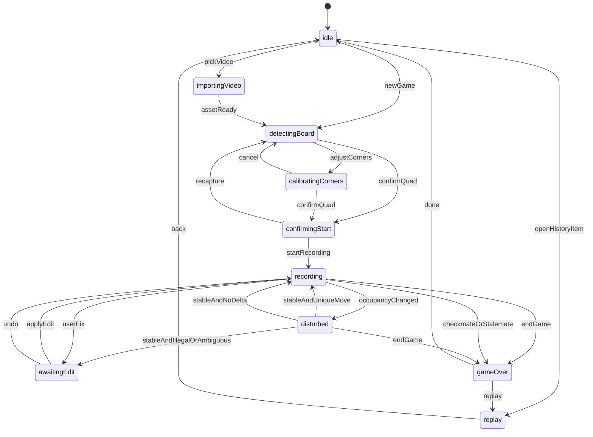
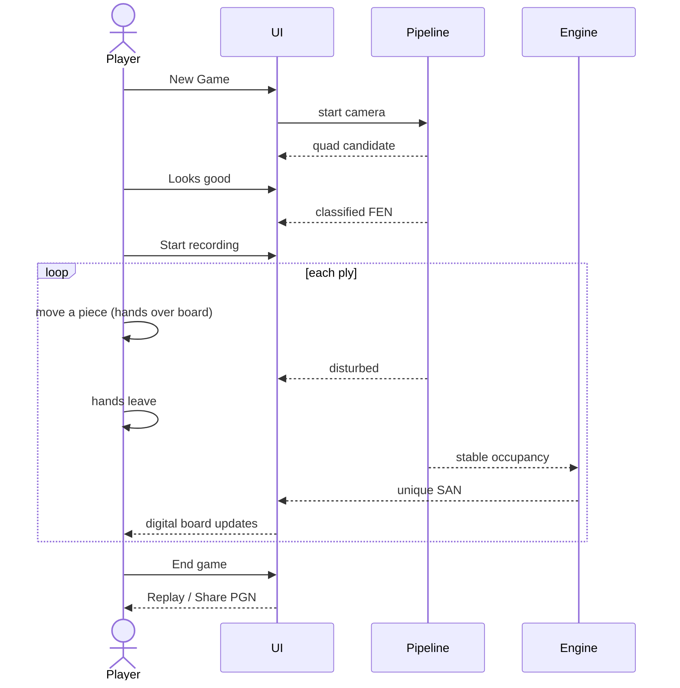

# Chess Camera — App Flow

**Companion to:** [PRD.md](PRD.md), [UI_UX.md](UI_UX.md), [TRD.md](TRD.md)

---

## 1. Phase machine

`SessionPhase` is the single source of UI + pipeline mode. Illegal transitions are programmer errors; the ViewModel only exposes intents.

`editingMove` in the product sense is the sheet `awaitingEdit` (or a user-initiated edit from the move list while `recording`). The board is frozen on the last committed position while the sheet is open; frames still run so the camera does not look frozen, but **commits are paused**.

---

## 2. User intents

| Intent | From | To | Side effects |
|---|---|---|---|
| `newGame` | idle | detectingBoard | Start `LiveCameraSource`, reset `GameEngine` |
| `confirmQuad` | detecting / calibrating | confirmingStart | Lock quad, warp, classify 64 squares, propose FEN + orientation |
| `flipBoard` | confirmingStart | confirmingStart | Toggle `BoardOrientation`, remap FEN |
| `recapture` | confirmingStart | confirmingStart | Re-run classify (stay in phase) |
| `startRecording` | confirmingStart | recording | Snapshot occupancy baseline, `lastCommitted = current` |
| `endGame` | recording / disturbed | gameOver | Confirm if ≥1 move and not mate; save `GameRecord` |
| `applyEdit(san)` | awaitingEdit / recording | recording | `GameEngine.apply` or replace; refresh occupancy from engine |
| `undo` | recording / awaitingEdit | recording | `GameEngine.undo`; occupancy follows FEN |
| `openReplay` | idle / gameOver | replay | `Game(pgn:)` |
| `sharePGN` | gameOver / replay | same | Activity sheet |
| `pickVideo` | idle | importingVideo → detectingBoard | `AssetVideoSource` |

---

## 3. Happy path (physical game)

---

## 4. Setup ritual (teach once)

Show a one-page primer the **first** time (UserDefaults `didSeeSetupPrimer`). Skip thereafter; reachable from History overflow.

1. One chess set, indoor light, **standard starting position**.
2. Mount the iPhone so **every square is visible**. A tripod is best; a stand at an angle is fine.
3. Do not move the phone during the game.
4. Play naturally. Pause off the board between moves. The app waits until the position is still.
5. If a move is wrong, tap it and fix. You do not need to confirm every move.

Copy on the primer CTA: **Set up the board**. Then `newGame`.

---

## 5. Flow by screen (detailed)

### History → New Game

- If camera undetermined: request access, then detecting.
- If denied: permission dead-end until Settings.
- If granted: `detectingBoard`.

### Detecting

- Pipeline runs localizer only (no 64-class yet).
- User **Looks good** even if we could auto-lock — explicit confirm for live.
- **Adjust corners** always available.

### Confirm start

- Majority-vote 3 warped frames if time allows (< 1 s).
- Illegal FEN: primary path is Recapture, not Start.
- Flip is orientation only; it does not reclassify.

### Live

- Pipeline: occupancy at 5–10 Hz, settle 600 ms.
- Disturbed is automatic; no user action.
- Unique match: apply, haptic, announce SAN.
- 0/N matches after settle: `awaitingEdit`, banner **Fix**.
- Checkmate/stalemate from `board.state`: present Game Over (user can still Undo if it was a misread).

### End game

- If `board.state` is mate/stalemate: skip confirm.
- Else: “End game and save PGN?” **End** / **Keep playing**.
- Discard with 0 moves: no SwiftData row.

### Replay

- Independent of the camera. Tear down capture when leaving Live / Game Over to History.
- Scrubbing does not mutate `GameRecord` until we add annotations (we don’t).

### Video import (builder path)

History overflow **Process a video…** → PhotosPicker (movies) → same detect → confirm → recording, but settle uses **video timestamps**. Useful for the demo if the live table fails: play a known video on the phone.

---

## 6. Edge flows

| Situation | Flow |
|---|---|
| Tracking lost mid-game | Banner “Board lost” + **Adjust corners**; pause commits; do not auto-end |
| User backgrounds the app | Stop session running; on return, stay in phase but re-start camera; treat as disturbed |
| Phone rotated | Update video orientation + overlay mapping; do not reset FEN |
| Promotion | Inferrer uses destination class; if still ambiguous, `awaitingEdit` with Q/R/B/N picker |
| User edits an old ply not the last | MVP: only last ply is editable/undoable. Earlier history is stretch. Copy in UI: undo is “Undo last move.” |
| Two quick moves before settle | Occupancy may jump start→end of both. Inferrer will likely `.illegal` or `.ambiguous` → Fix. Players should not blitz without a pause. Document in primer. |

---

## 7. Demo script (presentation)

**Time box:** ~3–5 minutes live, plus backup video.

### Prep (before walking on stage)

- Board in standard start, demo lighting, phone mounted, full board in frame.
- App on History. Primer already dismissed.
- Backup: a 20-ply recorded video on the phone.

### Live

1. **New Game.** Point at the camera quad locking. **Looks good.**
2. Confirm start — “Standard starting position.” **Start recording.**
3. Play a prepared line that shows variety, e.g.:
   - `1. e4 e5`
   - `2. Nf3 Nc6`
   - `3. Bb5 a6` (capture setup)
   - `4. Bxc6` (capture)
   - Short castle later if time (`O-O`)
4. Call out the HUD: hands up → “Waiting for the board…” → SAN appears.
5. Optionally **Undo** then replay the same move to show correction.
6. **End game** → **Share PGN** (AirDrop / copy). Open Replay, step two moves.

### If live vision dies

History → Process a video → same UI. Say: “Same pipeline; video is how we tested.”

### What to say

Lead with reconstruction + chess rules, not classifier accuracy. Name the constraints: one set, still camera, settle window, edit when unsure.

---

## 8. First-run vs returning

| | First launch | Later |
|---|---|---|
| Primer | Show | Skip |
| Camera permission | System + explanation if denied | Direct to detect |
| History | Empty state | List |
| Calibration | Every game | Every game (saved-quad stretch) |

---

## 9. Session teardown

On `done` / History appear:

1. `frameSource.stop()`
2. Cancel pipeline tasks
3. Drop `RecordingSessionViewModel` or reset to `idle`
4. Keep SwiftData context

Never leave `AVCaptureSession` running on History.
